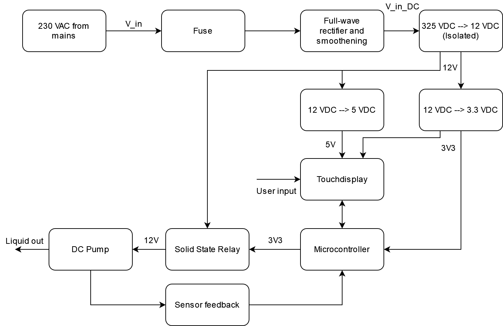
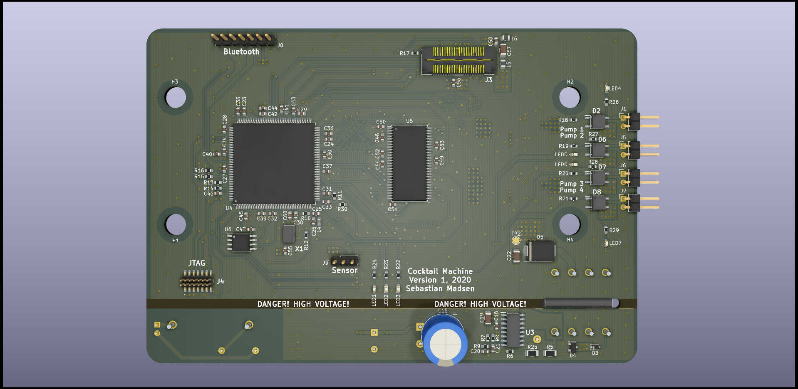
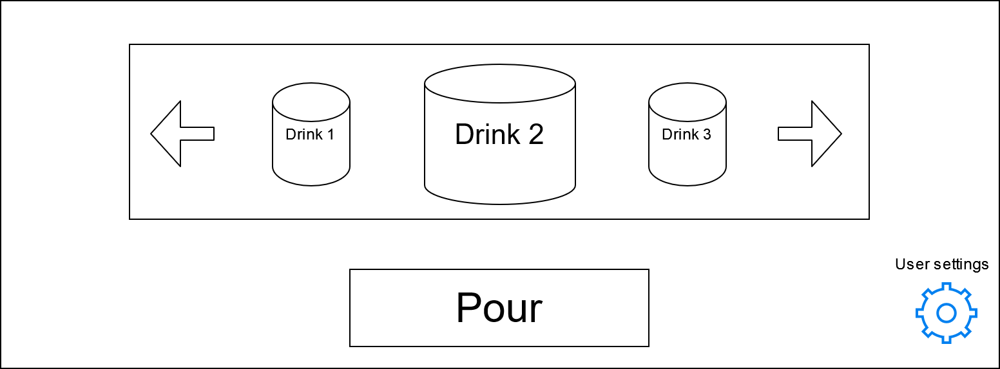

# Cocktail Machine
Contains the code and PCB used for the actual implementation of the STM32F4-based cocktail machine.

The DiscoveryDemo folder contains a TouchGFX demo used on the STM32F769 Discovery Board from ST.

Documentation, including a system report written in LaTeX, can be found in the Documentation folder.

## Overview
A block diagram overview of the system is shown below.

## Hardware
The PCB has been designed with inspiration from ST's discovery board.

## Software
A preliminary GUI template is shown below. This has been implemented in TouchGFX.

